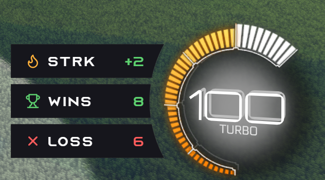

# 🎮 RL Stats Overlay

[🇫🇷 Français](README.md) · **🇬🇧 English**

> **Rocket League overlay for OBS and in-game HUD.** Live session wins, losses and streak, in real time. Easy Anti-Cheat compatible — uses only the **official Psyonix Stats API**, no injection.

  
  
  
  

---

## ✨ What it does

  
   <em>Preview: your live session (wins, losses, streak) shown over Rocket League.</em>

- **A live overlay of your session**: number of **wins**, **losses**, and the current **streak** (🔥 win streak, ❄️ loss streak). Numbers update on their own at the end of every match.
- **Two display modes** (or both at once):
  - 🎮 **In-game HUD** — a small transparent window placed on top of Rocket League while you play
  - 📺 **OBS Browser Source** — to display it on your stream
- **Several themes** ready to use (and you can build your own — see [the designer guide](docs/themes-en.md))
- **Smart session**: your wins/losses are saved and persist between restarts. The session resets itself after 6h of inactivity (new gaming day = clean counters).
- **Guided setup**: no need to dig through your files — the app finds your Rocket League install on its own (Steam or Epic) and turns on the "live stats" feature already built into the game (but disabled by default). All you need to do is type your in-game name so the overlay knows which player is you.

## 🚀 Install (3 minutes, zero command line)

1. Go to the [**Releases**](https://github.com/kevindjf/rl-stats-overlay/releases/latest) page
2. Download `RL Stats Overlay_x.y.z_x64-setup.exe`
3. Double-click to run the installer
4. On first launch, follow the **setup wizard**:
   - Pick your Rocket League install (auto-detected)
   - Type your in-game name (exactly as it appears in match)
   - Done — **restart Rocket League** to activate the Stats API

> ### ⚠️ Windows shows "Microsoft Defender SmartScreen prevented an unrecognized app from starting"
>
> **This is expected.** The app isn't (yet) signed with a paid code-signing
> certificate — Windows shows this warning by default on any binary from a
> publisher it doesn't know, regardless of the content.
>
> **To get past it**: on the SmartScreen window, click **More info**, then
> the **Run anyway** button that appears.
>
> The full source is public in this repo and you can submit the `.exe` to
> [VirusTotal](https://www.virustotal.com) for an independent analysis if
> you want one. See [Troubleshooting](docs/troubleshooting.md#windows-smartscreen-affiche-windows-a-protégé-votre-pc) for more details.

## 🟢 In-game HUD usage

1. Open RL Stats Overlay
2. Click **▶ Show HUD** → a transparent window appears
3. To position it, use the **X / Y / Width / Height** fields in the *HUD* section (step adjustable from 1 to 50 px). Values are saved and persisted across restarts.

> ⚠️ **Important**: Rocket League must run in **borderless fullscreen** for the transparent window to show on top of it. In RL: *Settings → Video → Window Mode → **Borderless**.*

> 💡 Mouse drag is coming in a future version. For now, positioning is pixel-perfect through the numeric steppers.

## 📺 OBS usage (streamers)

1. In RL Stats Overlay, click **📋 Copy URL**
2. In OBS: **Sources → + → Browser Source**
3. Make sure **Local file** is unchecked
4. Paste the URL into the **URL** field
5. Width: `320` · Height: `360`
6. ✓

The overlay runs as long as the `RL Stats Overlay` app is open on your machine. You can close it once your stream is over.

## 🛡 Easy Anti-Cheat compatible

The app **injects nothing** into Rocket League. It only reads the **official Psyonix Stats API**, exposed natively by the game over a local WebSocket (`ws://localhost:49123`). It's the same API the pro broadcasters use for the RLCS.

Unlike BakkesMod / SOS, no DLL injection, no memory reads, no action on the matchmaking server side. The only change made is activating a feature that's **dormant but official** in `DefaultStatsAPI.ini`.

## 📂 Configuration

The whole config lives in a single JSON file:

- **Windows**: `%APPDATA%\RLStatsOverlay\settings.json`
- **macOS (dev)**: `~/Library/Application Support/RLStatsOverlay/settings.json`

You can delete it to start over (the wizard will run again).

## 🧰 For developers / contributors

See [docs/development.md](docs/development.md) for:

- Running the app in dev mode (Windows or macOS)
- Testing overlays without Rocket League via the mock server (`bun run dev/mock-server.ts`)
- Building locally
- Project architecture

## 📜 License

[MIT](./LICENSE) — project not affiliated with Psyonix or Epic Games. *Rocket League* is a registered trademark of Psyonix LLC.
