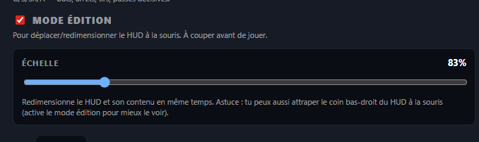
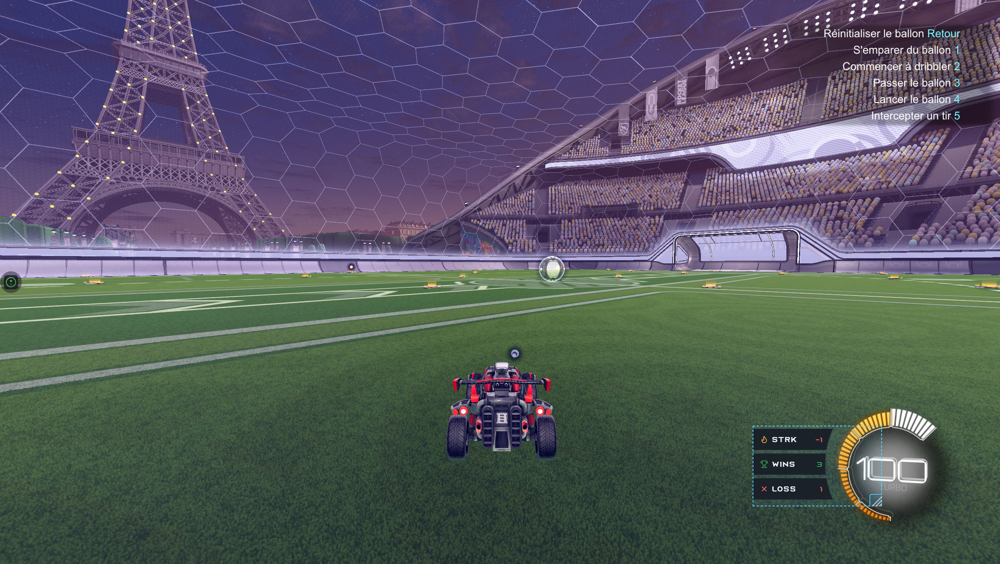
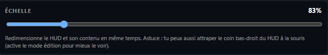

# Mode édition

Le **Mode édition** est un toggle unique qui bascule le HUD entre deux états :

- **Activé** — tu places et redimensionnes le HUD à la souris (drag, poignée, slider).
- **Désactivé** — le HUD redevient discret et **clic-traversant** (les inputs souris passent au jeu, idéal pendant une partie).

## Activer le Mode édition

1. Ouvre RL Stats Overlay.
2. Déplie la section **HUD en jeu**.
3. Coche **Mode édition** en haut de la section.

{ loading=lazy }

Visuellement sur le HUD :

- Une **bordure cyan pointillée** apparaît sur les 4 bords de la fenêtre — tu vois enfin la zone réelle (sinon elle est totalement transparente).
- Une **grosse poignée cyan** apparaît dans le coin bas-droit pour le redimensionnement à la souris.
- Le HUD redevient **interactif** (plus clic-traversant) — tu peux le drag avec la souris.

{ loading=lazy }

## Déplacer à la souris

Clic-gauche maintenu **n'importe où sur le HUD** (sauf la poignée), drag, relâche. La position est persistée immédiatement.

## Redimensionner avec la poignée

Clic-gauche maintenu **sur la grosse poignée cyan** (coin bas-droit), drag pour redimensionner. Le contenu (cards, icônes, texte) **scale automatiquement** avec la fenêtre — l'échelle est calculée en CSS pour que les proportions soient toujours correctes.

<!-- IMAGE: images/edit-mode-grip-zoom.png — zoom on bottom-right grip (400×400) -->

## Slider Échelle (50–250 %)

Pour un contrôle précis sans toucher la souris :

- **50 %** = HUD compact (200×150 px à scale 1).
- **100 %** = taille par défaut (400×300 px).
- **250 %** = HUD très visible (1000×750 px).

Le slider redimensionne **proportionnellement** la fenêtre depuis le coin haut-gauche, donc le contenu reste visuellement stable au même endroit pendant que tu fais glisser.

{ loading=lazy }

## Placement précis (X / Y / W / H)

Sous le slider, quatre champs numériques permettent un placement au pixel près :

- **X / Y** — position du coin haut-gauche de la fenêtre, en pixels physiques.
- **W / H** — largeur et hauteur, en pixels physiques.

Le sélecteur **Pas** (1 / 5 / 10 / 50 px) ajuste l'incrément des boutons +/-.

<!-- IMAGE: images/edit-mode-fields.png — X/Y/W/H input fields (800×300) -->

## Quitter le mode édition

**Décoche Mode édition** ou fais un **clic-droit → Verrouiller / déverrouiller** sur le HUD. Le HUD redevient :

- **Clic-traversant** — les inputs souris passent au jeu.
- **Sans bordure** — totalement discret, idéal pendant une partie ou une stream.

> 💡 N'oublie pas de couper le mode édition avant de jouer — sinon les clics gauches sur le HUD ne passeront pas au jeu.
