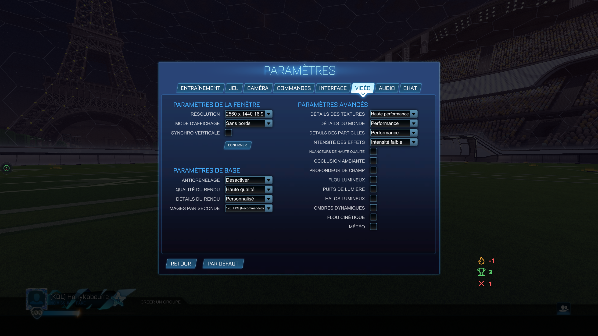

# HUD in-game — vue d'ensemble

Le HUD in-game est une **petite fenêtre transparente** posée par-dessus Rocket League qui affiche tes stats de session en direct (wins / losses / streak) sans interférer avec le jeu.

## À quoi ça sert

- Voir ta session en direct sans Alt-Tab.
- Stream ton écran et avoir tes wins/losses visibles dans la capture si tu ne veux pas configurer OBS.
- Garder un œil sur ta streak pour décider quand t'arrêter (ou continuer).

## Lancer le HUD

1. Ouvre **RL Stats Overlay**.
2. Dans la section *HUD en jeu*, clique **▶ Afficher le HUD** — une fenêtre transparente apparaît au centre de ton écran principal.
3. Active le **[Mode édition](edit-mode.md)** pour la déplacer et la redimensionner.

{ loading=lazy }

## Borderless obligatoire

> ⚠️ Rocket League doit tourner en **plein écran fenêtré (borderless)** pour que la fenêtre transparente s'affiche par-dessus.

Dans Rocket League : **Settings → Video → Window Mode → Borderless**.

{ loading=lazy }

Le mode "Fullscreen" exclusif n'est **pas supporté** par Windows pour les overlays — c'est une limitation du système, pas de l'app. Voir aussi [Dépannage](../troubleshooting.md).

## Menu clic-droit

Un clic-droit sur le HUD ouvre un menu rapide :

- **Réinitialiser la session** — wins/losses repartent à zéro.
- **Verrouiller / déverrouiller** — bascule le [Mode édition](edit-mode.md).
- **Quitter** — ferme l'app entièrement.

## Aller plus loin

- [Mode édition](edit-mode.md) — déplacer, redimensionner, scale au pourcentage.
- [Bouton flottant](floating-launcher.md) — accès rapide aux réglages depuis le bord de l'écran.
- [Auto-masquage](auto-hide.md) — afficher/masquer le HUD automatiquement avec Rocket League.
