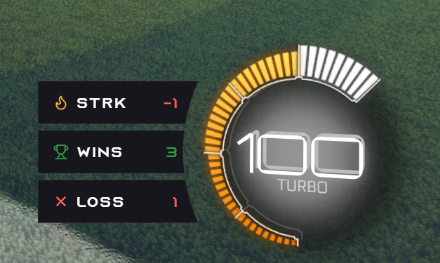

# RL Stats Overlay

> **Overlay Rocket League pour OBS et HUD in-game.** Wins, losses et streak de session, en temps réel. Compatible Easy Anti-Cheat — utilise uniquement la **Stats API officielle Psyonix**, aucune injection.

{ loading=lazy }

## Aperçu

RL Stats Overlay affiche en direct **wins / losses / streak** de ta session par-dessus Rocket League ou dans une scène OBS. À chaque match terminé, les compteurs bougent tout seuls — pas d'action nécessaire de ta part.

## Pourquoi RL Stats Overlay

- **EAC-safe** : aucune injection, aucune lecture mémoire. L'app lit uniquement la Stats API officielle exposée par Rocket League sur `ws://localhost:49123` — la même que les broadcasters RLCS.
- **Deux surfaces, une seule app** : HUD transparent in-game **et** Browser Source OBS, alimentés par la même session.
- **Setup guidé** : détection auto de Rocket League (Steam/Epic), activation auto de la Stats API, détection auto de ton compte. Aucune ligne de commande.
- **Stats live du match** : buts, arrêts, tirs, passes décisives, mis à jour à chaque tick.
- **Plusieurs thèmes** prêts à l'emploi (et tu peux créer le tien — voir [Guide designer](themes/designer-guide.md)).

## Démarrer en 3 minutes

- :material-download:{ .lg } **[Installation](install.md)**

    Télécharger, installer, suivre le wizard de premier lancement.

- :material-monitor:{ .lg } **[HUD in-game](hud/index.md)**

    Afficher le HUD transparent par-dessus Rocket League.

- :material-broadcast:{ .lg } **[OBS Browser Source](obs/index.md)**

    Coller l'URL dans une scène OBS pour stream.

## Liens utiles

- 💾 [Releases (téléchargement)](https://github.com/kevindjf/rl-stats-overlay/releases/latest)
- 🐛 [Signaler un bug / proposer une feature](https://github.com/kevindjf/rl-stats-overlay/issues)
- 🛠 [Code source](https://github.com/kevindjf/rl-stats-overlay)
- 📜 [Licence MIT](https://github.com/kevindjf/rl-stats-overlay/blob/main/LICENSE)

<!-- IMAGE CHECKLIST
  - images/preview.png            (KEEP existing)
  - images/hero-banner.png        1920×600  HUD overlaid on a blurred RL match
  - images/card-hud.png           480×320   HUD-only crop
  - images/card-obs.png           480×320   OBS scene with overlay corner
-->
