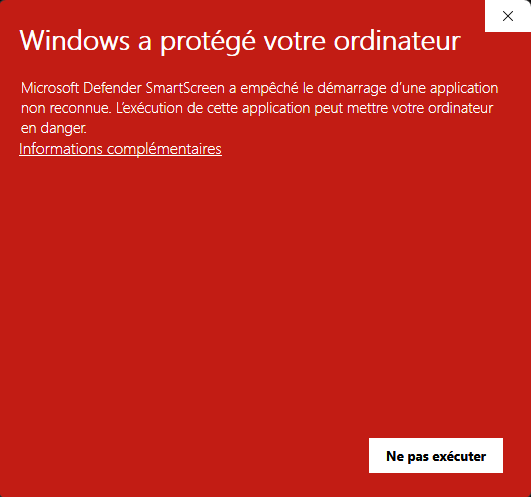
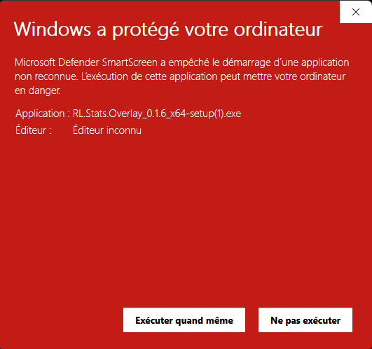

# Install

Three minutes, zero command line.

## Download

1. Open the [**Releases**](https://github.com/kevindjf/rl-stats-overlay/releases/latest) page.
2. Download `RL Stats Overlay_x.y.z_x64-setup.exe` (Windows 64-bit).

> macOS / Linux aren't supported as official builds — the app is tested on Windows 10 / 11. For dev environments, see [Contributing → Development](contributing/development.md).

## Install

Double-click the downloaded `.exe`. The NSIS installer offers a "current user" mode — no admin rights needed.

## First launch (wizard)

On first launch, the wizard walks you through:

1. **Detected install** — the app finds your Rocket League install on its own (Steam or Epic). If detection fails, use the "📂 Pick a folder manually" button.
2. **Stats API activation** — the app patches `DefaultStatsAPI.ini` for you (with an automatic backup of the previous file). This is an official Psyonix feature, simply disabled by default.
3. **In-game name** — *only if* auto-detection of your Steam/Epic account failed. Otherwise this step is skipped and the overlay will identify you on the first match.

After the wizard, **restart Rocket League** if the game was already running while the change was applied.

## Windows SmartScreen

On the first launch of the `.exe`, Windows shows **"Windows protected your PC"**.

This is expected: the app isn't yet signed with a paid code-signing certificate. Windows shows this warning by default on any binary from a publisher it doesn't know, regardless of the content.

**To get past it (two steps)**:

1. On the first dialog, click the underlined **"More info"** link (right under the red message). At this stage only the "Don't run" button is visible — that's by design.

    { loading=lazy }

2. The dialog updates: you now see the file name, "Unknown publisher", and **a new "Run anyway" button** appears at the bottom. Click it.

    { loading=lazy }

The full source is public in [the GitHub repo](https://github.com/kevindjf/rl-stats-overlay) — you can submit the `.exe` to [VirusTotal](https://www.virustotal.com) for an independent analysis. See also [Troubleshooting](troubleshooting.md).

## Uninstall

- Via Windows: **Settings → Apps → RL Stats Overlay → Uninstall**.
- To also wipe persisted settings: delete the folder `%APPDATA%\RLStatsOverlay`.
