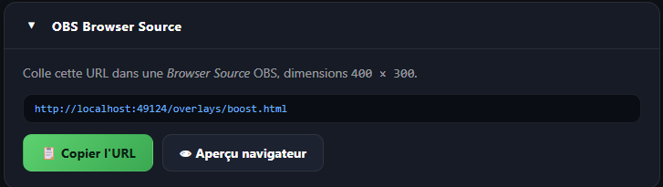

# OBS — full guide

## Quick install

1. Launch **RL Stats Overlay**
2. Click **📋 Copy URL** in the *OBS Browser Source* section
3. In OBS: **Sources** → **+** → **Browser**
4. Uncheck **Local file**
5. Paste the URL into the **URL** field (`http://localhost:49124/overlays/boost.html` or similar)
6. Width: `320` · Height: `360`
7. Optionally tick **Refresh browser when scene becomes active**
8. ✓

{ loading=lazy }

## Positioning

The boost overlay is designed to align **around Rocket League's boost gauge**, which sits in the bottom-right corner of the screen.

- At 1080p, the gauge is ~200 px in diameter
- The overlay (320 × 360) wraps around it with a 200 px central hole (the gauge stays visible)
- Turn on the source's edit mode in OBS, place the overlay center over the gauge center

> 💡 For 1440p or 4K output, scale the source in OBS rather than enlarging the HTML.

## Multiple stacked overlays

You can add several Browser Sources with the same URL — they all sync (same `localStorage` on the OBS browser side, so wins/losses increment at the same place).

If you want separate overlays (e.g. one for stream and one for your capture PC), each will display the same session because they query the same local backend.

## Compatibility

- **OBS Studio** ≥ 28: ✅ tested
- **Streamlabs**: ✅ same mechanism
- **XSplit**: *not tested*, should work (standard Browser Source)

## Common issues

**The overlay is blank / white**
→ The `RL Stats Overlay` app must be running on the same machine as OBS. The URL uses `localhost` which doesn't leave the machine.

**The overlay is too small / pixelated**
→ Increase Width/Height in the Browser Source (e.g. 640 × 720) rather than scaling the source in OBS.

**The counter jumps**
→ If you refresh the Browser Source mid-stream, the session resets to zero on the OBS side. This is intentional — the "true" counter lives in the desktop app, which is the source of truth. You can re-sync by clicking **Refresh** again or restarting the source.
