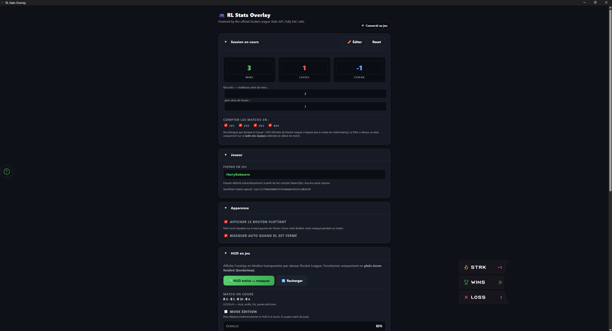
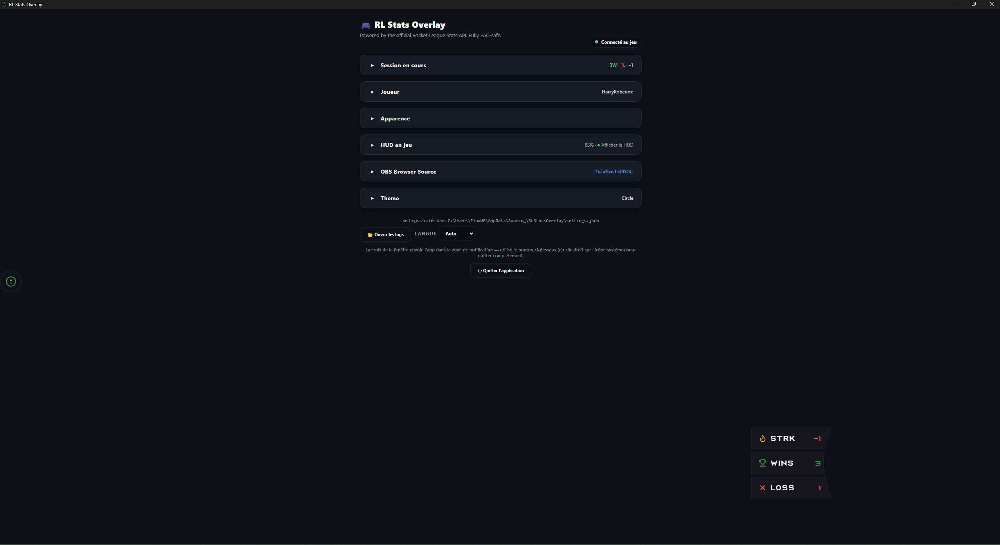

# Settings window

A tour of the settings window — what's in it, how to navigate.

## Overview

The window is organized into **6 collapsible sections**:

1. **Current session** — wins / losses / streak + team size filter.
2. **Player** — in-game name + captured stable identifier.
3. **Appearance** — floating launcher, HUD auto-hide.
4. **In-game HUD** — show/hide HUD, edit mode, scale, X/Y/W/H, current-match stats.
5. **OBS Browser Source** — URL to paste into OBS, copy/preview.
6. **Theme** — active theme + all theme overrides.

{ loading=lazy }

## Collapsible sections

Each section is an HTML `
` — click the **title** to fold or unfold. A **chevron** to the left of the title rotates 90° when the section is open.

## Brief summaries (when collapsed)

When a section is collapsed, a **brief summary** stays visible to the right of the title. It gives you the key info without unfolding:

| Section | Collapsed summary |
|---|---|
| Current session | `12W · 5L · +3` (green/red W/L colors) |
| Player | Your in-game name in white |
| Appearance | (none) |
| In-game HUD | `120% · ● Show HUD` |
| OBS Browser Source | `localhost:49124` |
| Theme | Active theme name (e.g. `Circle`) |

When the section is open the summary disappears (the data is already visible in the body) — no duplication.

{ loading=lazy }

## State persistence

The **open / closed** state of each section is saved in WebView2's `localStorage` (key `panel:<id>`). On every app restart, sections recover their previous state.

## Section details

### Current session

- **Wins / Losses / Streak** shown in large numbers, with green/red colors based on streak direction.
- **✏️ Edit** button for manual corrections (useful after a mid-match crash or missed event).
- **Reset** button to start fresh.
- **Count matches in** filter: 1v1 / 2v2 / 3v3 / 4v4 — doesn't distinguish Ranked vs Casual (the Stats API doesn't expose the mode), but at least lets you scope the session to a team size.

### Player

- **In-game name** + stable identifier captured on first match (format `Steam|123|0` or `Epic|abc|0`).
- If Steam/Epic is auto-detected, no input is needed.
- The identifier survives in-game name changes — captured once, kept forever.

### Appearance

- **Show floating launcher** — see [Floating launcher](../hud/floating-launcher.md).
- **Auto-hide when RL is offline** — see [Auto-hide](../hud/auto-hide.md).

### In-game HUD

- See [In-game HUD](../hud/index.md) and [Edit mode](../hud/edit-mode.md).

### OBS Browser Source

- See [OBS Browser Source](../obs/index.md).

### Theme

- See [Themes](../themes/index.md).
