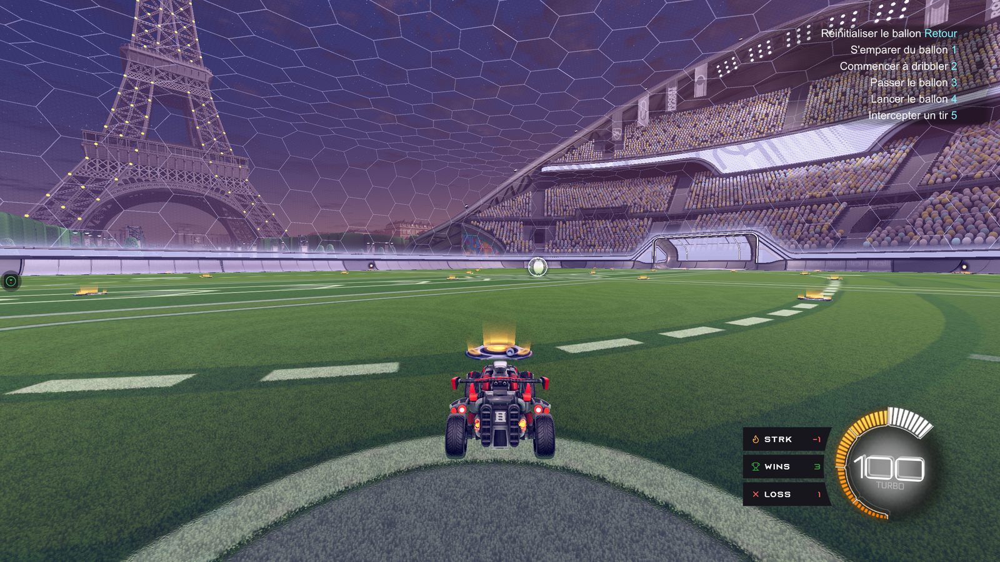
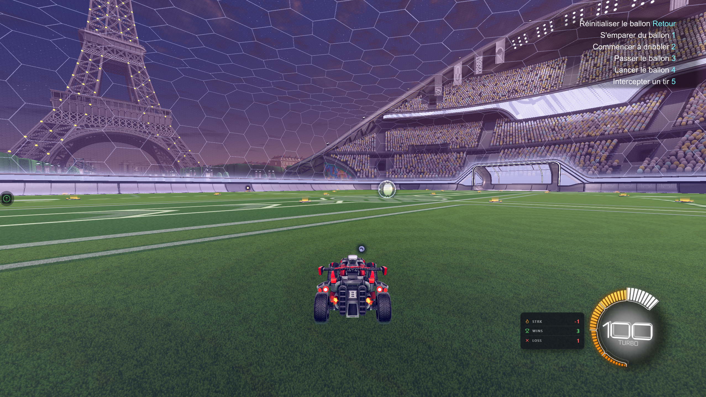
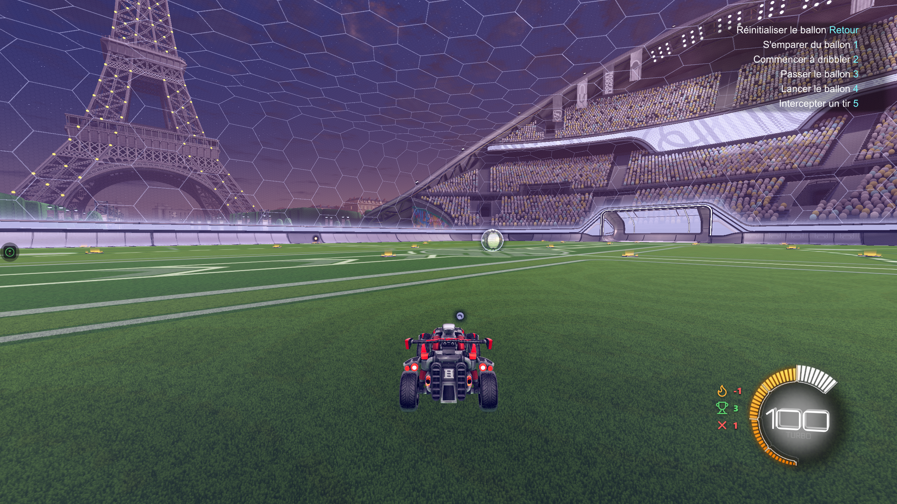

# Thèmes inclus

RL Stats Overlay est livré avec **4 thèmes** prêts à l'emploi. Tu peux passer de l'un à l'autre depuis la section **Theme** des réglages, ou créer le tien (voir [Guide designer](designer-guide.md)).

## Galerie

- **Circle**

    { loading=lazy }

    *Le thème par défaut.* Trois cards empilées (Streak / Wins / Losses) avec un bord droit concave qui épouse la jauge de boost de Rocket League.

- **Default**

    { loading=lazy }

    *Le plus discret.* Petite plaque semi-transparente avec trois lignes de texte. Idéal si tu veux quelque chose de neutre qui se fond dans n'importe quelle scène.

- **Minimal**

    { loading=lazy }

    *Glass discret.* Panneau plat avec backdrop-filter blur. Les valeurs en gros, les labels en petit caps. Parfait pour les streamers qui veulent un HUD propre.

- **Redesigned**

    { loading=lazy }

    *Sans plaque.* Trois icônes colorées géantes flanquées de gros chiffres, sans fond. Très lisible par-dessus n'importe quelle scène, même claire.

<!-- IMAGE CHECKLIST
  - images/theme-circle.png        480×360  Circle theme rendered
  - images/theme-default.png       480×360  Default theme rendered
  - images/theme-minimal.png       480×360  Minimal theme rendered
  - images/theme-redesigned.png    480×360  Redesigned theme rendered
-->

## Changer de thème

1. Ouvre la fenêtre des réglages.
2. Déplie la section **Theme**.
3. Choisis un thème dans la liste déroulante **Active theme**.

Le HUD et la Browser Source OBS appliquent le changement immédiatement, sans reload.

## Personnaliser un thème

Chaque thème expose une série de **variables CSS** (couleurs, tailles, polices) éditables directement dans la section **Theme**. Les valeurs modifiées sont persistées par thème — tu peux switch puis revenir, tes overrides sont conservés.

Bouton **Reset all overrides** pour repartir des valeurs par défaut du thème.

## Installer un thème reçu

1. Clique **📁 Dossier des thèmes** dans la section Theme — l'explorateur Windows s'ouvre sur `%APPDATA%\RLStatsOverlay\themes\`.
2. Décompresse le thème reçu (un dossier contenant au minimum `theme.json`, `boost.html`, `boost.css`).
3. Clique **🔄 Rafraîchir** dans la section Theme — le thème apparaît dans la liste déroulante.

<!-- IMAGE: images/themes-folder-explorer.png — Windows Explorer on themes folder (900×500) -->

## Créer le tien

Voir le [Guide designer](designer-guide.md) — couvre la structure d'un thème, le format `theme.json`, les conventions HTML/CSS/JS, et la distribution.
